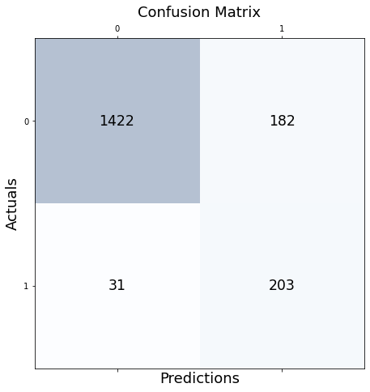

# SMS-Spam-Detection

# Dataset:
Data is the essential ingredients before we can develop any meaningful algorithm. Knowing where to get your data can be a very handy tool.I've attached the Dataset I have used. This dataset classifies the data into two categories- Ham and Spam. Ham looks like a normal SMS reply to another person, which is not difficult to classified as a ham. The spam data looks similar to one of those junk advertising SMSs.
# Test-Train split:
It is important to split your data set to training set and test set, so that you can evaluate the performance of your model using the test set before deploying it in a production environment. One important thing to note when doing the train test split is to make sure the distribution of the data between the training set and testing set are similar. What it means in this context is that the percentage of spam email in the training set and test set should be similar.
# Data preprocessing:
Text Cleaning is a very important step in machine learning because your data may contains a lot of noise and unwanted character such as punctuation, white space, numbers, hyperlink and etc. Some standard procedures that people generally use are:

1.convert all letters to lower/upper case

2.removing numbers

3.removing punctuation

4.removing white spaces

5.removing hyperlink

6.removing stop words such as a, about, above, down, doing and the list goes on… (not implemented as it found that the accuracy went down)

7.Word Stemming — Stemming algorithms work by removing the end or the beginning of the words, using a list of common prefixes and suffixes that can be found in that language.

8.Word lemmatization- Lemmatization is utilizing the dictionary of a particular language and tried to convert the words back to its base form. It will try to take into account of the meaning of the verbs and convert it back to the most suitable base form

# TfidfVectorizer - Term frequency-inverse document frequency

Word counts are good but can we do better? One issue with simple word count is that some words like ‘the’, ‘and’ will appear many times and they don’t really add too much meaningful information.
Another popular alternative is TfidfVectorizer. Besides of taking the word count of every words, words that often appears across multiple documents or sentences, the vectorizer will try to downscale them.

# Naive Bayes Classifier:
Using Naive Bayes library provided by sklearn library save us a lot of hassle in implementing this algorithm ourselves. We can easily get this done in a few lines of codes.

# Confusion Matrix :

# Cross Validation Score
Accuracy = 89.72%
Standard Deviation = 2.70%
